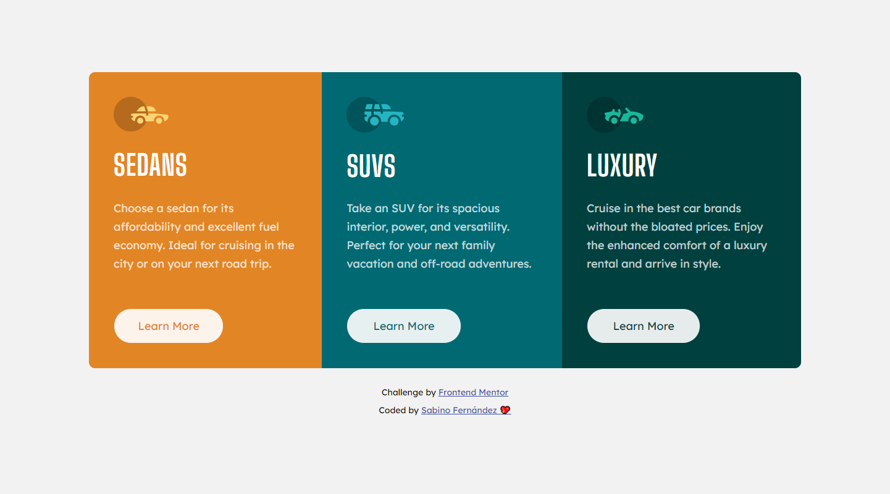

# Frontend Mentor - 3-column preview card component solution
his is a solution to the [3-column preview card component challenge on Frontend Mentor](htttps://www.frontendmentor.io/challenges/3column-preview-card-component-pH92eAR2-).

Frontend Mentor challenges help you improve your coding skills by building realistic projects.

## Overview

### The challenge

Users should be able to:

- View the optimal layout depending on their device's screen size
- See hover states for interactive elements

### Screenshot

The proposed project 

My solution

### Links

- Solution URL: [Add solution URL here](https://your-solution-url.com)
- Live Site URL: [GitHub Page](https://sabfer.github.io/3-Column-Card-Component/)

## My process

### Built with

- Semantic HTML5 markup
- CSS custom properties
- Flexbox
- Mobile-first workflow
- [SASS](https://sass-lang.com/) - CSS Preprocessor 

### What I learned

As I used SASS to compile my final CSS, I improve my knowledge about nesting classes in SASS. In the past I had trouble with this :innocent: 

### Useful resources

- [SASS Documentation](https://sass-lang.com/documentation) - It has been a while since the last time I used SASS so I need it a little help. Yes, this project was made on SASS but the .scss file it's not going to GitHub :rofl:

## Author

- Frontend Mentor - [@sabfer](https://www.frontendmentor.io/profile/sabfer)
- Twitter - [@www_sabino_com](https://www.twitter.com/www_sabino_com)
